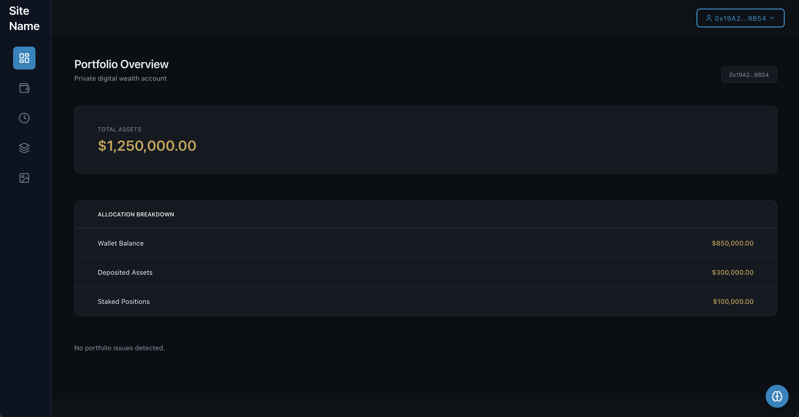
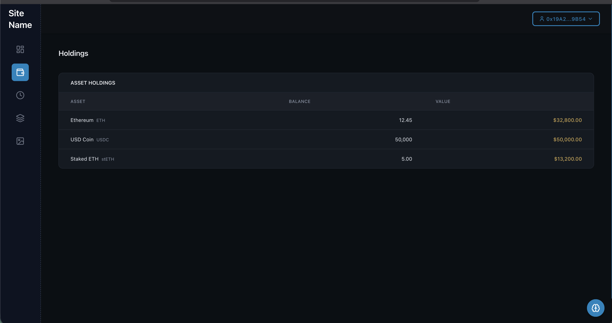
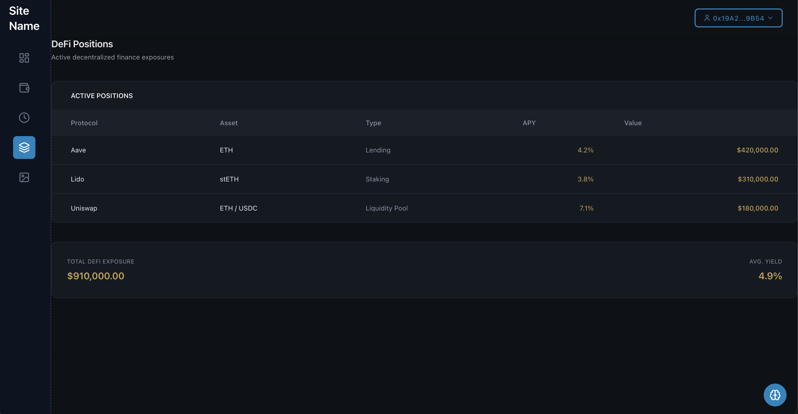
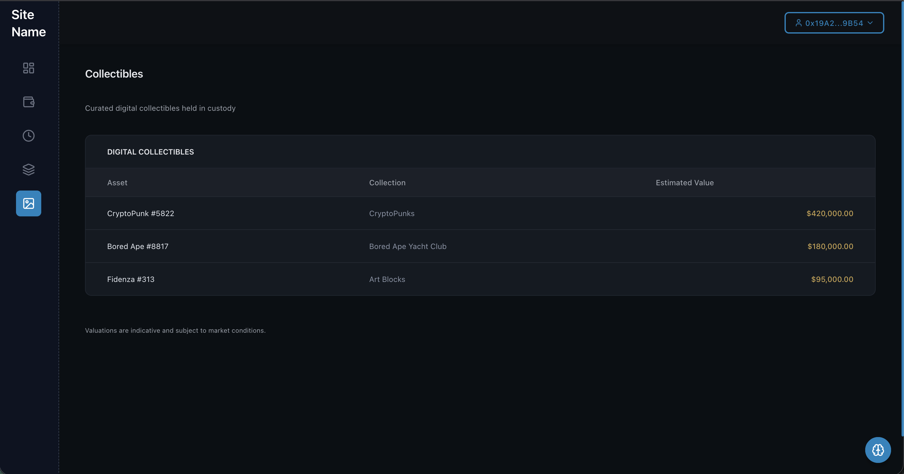
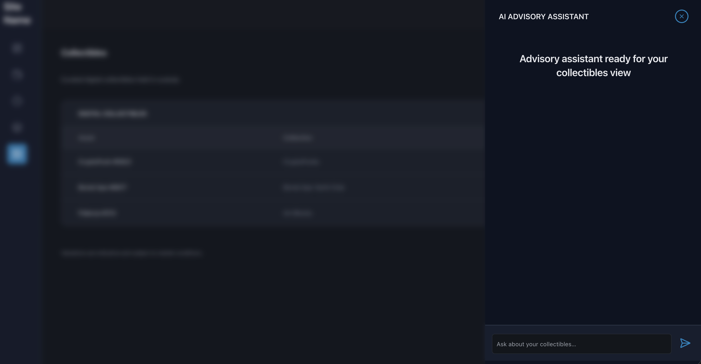

# Digital Wealth Platform

> Institutional-grade digital wealth platform for on-chain asset aggregation,
> analytics, and advisory intelligence — built with a banking-first architecture
> using React, TypeScript, Nx, and modular AI services.

A modern, institutional-grade digital wealth platform designed to provide a
consolidated, secure, and structured view of on-chain assets across multiple
networks, with advanced portfolio analytics and reporting capabilities.

The platform is built with a banking-first design philosophy, prioritizing
clarity, data integrity, and long-term scalability over speculative or
consumer-oriented interfaces.

---

## 🎯 Overview

**Digital Wealth Platform** enables users to monitor and analyze their digital assets through a unified private wealth dashboard.

Key capabilities include:

- **Multi-network asset aggregation**  
  Securely connect and monitor wallets across major blockchain networks including Ethereum, Arbitrum, Optimism, Base, and Polygon.

- **Comprehensive portfolio visibility**  
  Automatic discovery and classification of held assets, including tokens, digital collectibles, and decentralized finance positions.

- **Portfolio analytics and performance monitoring**  
  Structured views of total assets, allocation breakdowns, historical valuation, and exposure metrics.

- **Advisory-grade insights (engine-ready)**  
  The platform architecture supports advanced analytical engines designed to deliver portfolio insights, risk assessments, and performance evaluations without exposing conversational or chatbot-style interfaces.

- **Professional reporting and export**  
  Export portfolio data in standardized PDF and CSV formats for accounting, compliance, or external analysis.

The application is implemented as an Nx monorepo, ensuring modularity, scalability, and maintainability suitable for institutional-grade digital wealth products.

---

## 🖥️ Platform Preview

The following screenshots illustrate the core user experience and design philosophy of the Digital Wealth Platform.

### Portfolio Overview

A consolidated, executive-level view of the total digital wealth position, including asset allocation, network exposure, and historical performance.



---

### Asset Holdings (Tokens)

Institutional-style holdings table with deterministic valuation, price trends, and structured asset classification.



---

### DeFi Exposure

Clear visibility into decentralized finance positions, protocol exposure, and yield metrics, presented as financial instruments rather than interactive products.



---

### Digital Collectibles (NFTs)

Custodial-style view of digital collectibles with collection grouping, metadata visibility, and multi-chain support.



---

### AI Advisory Assistant

Context-aware advisory assistant powered by portfolio data, designed to deliver analytical insights without a chatbot-centric interface.




---

## 🏗️ Architecture

The platform is built using a modular monorepo architecture designed for long-term scalability, institutional reliability, and clear separation of concerns between presentation, data access, and analytical services.

This structure enables independent evolution of each domain while maintaining strict type safety and shared standards across the system.

### Monorepo Structure

```
digital-wealth-platform/
├─ apps/
│  ├─ web/                # Client-facing web application (React + Vite)
│  │                      # Responsible for portfolio visualization,
│  │                      # reporting, and user interaction
│  │
│  └─ analytics-gateway/  # Backend REST API
│                         # Portfolio analytics, data aggregation,
│                         # advisory engines, and external integrations
│
├─ libs/
│  ├─ wallet/             # Wallet connectivity and multi-network access layer
│  │                      # Abstracts blockchain providers and connection logic
│  │
│  ├─ data-hooks/         # Data access layer
│  │                      # React Query hooks and typed API clients
│  │
│  ├─ analytics-config/   # Configuration for analytical and advisory engines
│  │                      # Prompting, scoring models, and evaluation logic
│  │
│  ├─ insight-services/   # Analytical services and enrichment pipelines
│  │                      # Designed for portfolio analysis and risk modeling
│  │
│  ├─ market-charts/      # Financial charting components
│  │                      # Time-series, allocation, and performance visuals
│  │
│  ├─ shared-utils/       # Shared utilities and domain helpers
│  │                      # Formatting, validation, and normalization logic
│  │
│  └─ export-services/    # Reporting and export services
│                         # PDF and CSV generation for professional use
│
└─ tools/                 # Build scripts, automation, and infrastructure helpers
```
This architecture supports a banking-grade operating model where user interfaces, analytical logic, and data pipelines remain clearly decoupled, auditable, and extensible over time.


## 🔄 Data Flow

The platform follows a deterministic and auditable data flow designed to mirror institutional wealth management systems, ensuring clarity, security, and traceability at every stage.

1. **Client Authentication & Access**
   - The user connects a wallet through the secure access layer.
   - The `wallet` module abstracts network connectivity and identity resolution.

2. **Portfolio Data Retrieval**
   - The frontend requests portfolio data through a typed data access layer.
   - The `data-hooks` library manages data fetching, caching, and synchronization using React Query.

3. **Portfolio Representation**
   - The user interface renders consolidated portfolio views, including holdings, activity, DeFi exposure, and collectibles.
   - All data is normalized and presented in a read-only, banking-grade format.

4. **Analytical & Advisory Processing**
   - Portfolio data can be forwarded to analytical services for enrichment, scoring, and insight generation.
   - Advisory logic is handled server-side to ensure consistency and auditability.

5. **State Persistence**
   - User session state and preferences are persisted locally.
   - No sensitive transactional data is stored or mutated on the client.

---

## 🛠️ Technology Stack

The platform is built using a modern, enterprise-grade technology stack focused on performance, maintainability, and long-term extensibility.

### Frontend Application (`apps/web`)

#### Core Framework

- **React (Strict TypeScript mode)**  
  Component-driven UI architecture with predictable rendering behavior.

- **Vite**  
  High-performance build system optimized for modern web applications.

- **TypeScript**  
  Strong typing across the entire frontend codebase to reduce runtime risk.

#### Styling & Interface Layer

- **Tailwind CSS**  
  Utility-first styling system enabling consistent, design-token-driven interfaces.

- **Design System Components**  
  Reusable UI primitives for tables, layouts, typography, and controls.

- **Data Tables**  
  Institutional-style tables with pagination, filtering, and structured layouts.

- **Unified Dark Theme**  
  Single banking-grade visual theme focused on clarity and reduced cognitive load.

#### Web3 Connectivity

- **Wagmi / Viem**  
  Abstraction layer for blockchain connectivity and wallet interaction.

- **Multi-Network Support**  
  Designed to support multiple EVM-compatible networks through configuration.

#### State & Data Management

- **React Query**  
  Deterministic data fetching, caching, and background synchronization.

- **Local State Management**  
  Lightweight state persistence for session-level UI data.

- **Development Diagnostics**  
  Optional query inspection tools available in development environments only.

#### Data Visualization

- **Financial Charts**  
  Time-series and allocation charts designed for portfolio analysis.

- **Lightweight Visual Components**  
  Optimized for performance in dense data views.

#### Reporting & Export

- **PDF Generation**  
  Structured, professional-grade portfolio reports.

- **CSV Export**  
  Tabular exports compatible with external accounting and analysis tools.

---

### Backend Services (`apps/analytics-gateway`)

#### Core Services

- **Node.js Runtime**
- **Express-based REST API**
- **TypeScript-first implementation**

#### Analytical & Advisory Engines

- **Configurable Analysis Engines**  
  Designed for portfolio evaluation, risk assessment, and insight generation.

- **Pluggable Intelligence Providers**  
  Support for multiple analytical backends without frontend dependency.

#### Validation & Documentation

- **Schema Validation**
  Strict input and output validation for all endpoints.

- **OpenAPI / Swagger Documentation**
  Fully documented and explorable API surface.

#### Security & Performance

- **Rate Limiting**
  Protection against abuse and excessive request volume.

- **Response Caching**
  Short-lived caching for performance optimization.

- **Structured Logging**
  Centralized, production-grade logging strategy.

- **CORS Controls**
  Environment-specific access policies.

#### Advanced Analytics (Planned)

- **Contextual Retrieval Services**
  Architecture prepared for semantic analysis and enriched portfolio context.

- **Analytical Pipelines**
  Designed for future expansion into deeper risk and performance modeling.

## 📱 Platform Components

### 1. Client Wealth Interface (`apps/web`)

The client-facing application provides a structured, read-only digital wealth interface designed to resemble institutional private banking dashboards.

The interface focuses on clarity, capital visibility, and analytical transparency rather than interaction or experimentation.

---

#### Core Functional Areas

##### Portfolio Overview

- Consolidated view of total portfolio valuation.
- Asset distribution by custody type (wallet, deposited, staked, DeFi).
- Network-level exposure overview across supported blockchains.
- Deterministic valuation based on real-time market data.

This view serves as the primary executive summary of the client’s digital wealth position.

---

##### Asset Holdings (Tokens)

- Institutional-style holdings table covering all detected assets.
- Per-asset visibility including balance, unit price, and total valuation.
- Compact historical price trends displayed as sparklines.
- Search and filtering mechanisms for large portfolios.
- Paginated data presentation optimized for performance and readability.

All holdings are displayed in read-only mode with no execution capability.

---

##### Digital Collectibles (NFTs)

- Structured gallery view of non-fungible digital assets.
- Collection-level grouping and filtering.
- Asset metadata visibility for identification and provenance.
- Multi-network support abstracted into a single consolidated view.

This section is treated as a custodial inventory rather than a marketplace.

---

##### DeFi Exposure

- Structured overview of decentralized finance positions.
- Visibility into protocol-level exposure (lending, liquidity, staking).
- Position classification by strategy type.
- Performance and yield indicators where available.

DeFi positions are presented as financial exposures, not interactive products.

---

##### Activity Ledger

- Chronological ledger of historical on-chain activity.
- Classification by operation type (transfer, swap, approval, protocol interaction).
- Timestamped records with associated asset movements.
- Transparent fee and network cost visibility.

This ledger functions as an immutable activity record similar to a bank statement.

---

##### Reporting & Export

- Generation of structured portfolio reports in PDF format.
- CSV exports suitable for external accounting or analysis workflows.
- Coverage across all portfolio sections: holdings, collectibles, DeFi, and activity.

Exports are designed for compliance, reporting, and archival purposes.

---

#### Interface & Engineering Characteristics

- Deterministic rendering with strict type safety.
- Optimized data fetching and caching to reduce unnecessary network calls.
- Stateless, read-only UI architecture aligned with custodial viewing.
- Responsive layout adapted for desktop-first usage.
- Accessibility considerations aligned with enterprise UI standards.

---

### 2. Analytical & Intelligence Services (`apps/analytics-gateway`)

The backend services layer provides analytical processing, data enrichment, and optional intelligence capabilities.

This layer is intentionally decoupled from the user interface and does not expose conversational or chat-based interactions to end users.

---

#### Responsibilities

- Portfolio data aggregation and normalization.
- Analytical processing for valuation, exposure, and classification.
- Secure proxying of third-party data providers.
- Preparation of structured insights for future advisory modules.

---

#### Design Principles

- Server-side intelligence only — no AI-driven UI components.
- Deterministic outputs suitable for audit and review.
- Pluggable analytical engines to support future advisory features.
- Strict validation and schema enforcement across all endpoints.

The intelligence layer is designed to evolve into an internal advisory engine rather than a user-facing assistant.

### Analytical Intelligence Endpoints

The platform exposes internal analytical endpoints designed for portfolio intelligence and advisory processing.  
These endpoints are **not exposed as user-facing chat interfaces** and are intended for reporting, analysis, and future advisory automation.

---

#### `/api/portfolio-insights` (POST)

Purpose: Generate structured analytical insights derived from the complete portfolio state.

Request Body:
```json
{
  "portfolioData": {
    /* normalized portfolio dataset */
  },
  "provider": "openai"
}
```

Response:
```json
{
  "content": "Portfolio concentration analysis indicates ETH represents the largest exposure...",
  "usage": {
    "promptTokens": 250,
    "completionTokens": 180,
    "totalTokens": 430
  }
}
```

Features:
- Deterministic portfolio context injection
- Multi-provider intelligence support (OpenAI, Anthropic, local models)
- Strict schema validation (Zod)
- Token usage accounting for cost control
- Rate limiting: 20 requests per minute per IP

---

#### `/api/portfolio-analysis` (POST)

Purpose: Produce a comprehensive portfolio assessment covering valuation, allocation, and risk indicators.

Request Body:
```json
{
  "portfolioData": {
    /* complete portfolio dataset */
  },
  "provider": "anthropic"
}
```

Response:
```json
{
  "content": "The portfolio demonstrates moderate diversification with elevated exposure to Layer 1 assets...",
  "usage": {
    "promptTokens": 310,
    "completionTokens": 220,
    "totalTokens": 530
  }
}
```

These endpoints are designed to power internal analytics, reporting pipelines, and future advisory systems without introducing conversational UI components.


### Core Data & Portfolio Intelligence Endpoints

The backend exposes a set of structured, read-only endpoints designed to support institutional-grade portfolio analysis, reporting, and data aggregation.  
These endpoints prioritize determinism, caching, and operational safety.

---

#### Portfolio Intelligence — Features

- Deep analysis of portfolio diversification, risk exposure, and performance
- Data-driven recommendations based on normalized portfolio state
- Financial-grade analytical prompt structures
- Rate limiting enforced at 20 requests per minute per IP

---

#### `/api/zerion/wallets/{address}/portfolio` (GET)

Purpose: Retrieve a consolidated portfolio overview for a given wallet address.

Parameters:
- `address` (path): Ethereum wallet address
- `positions` (query, optional): Position filter (`no_filter`, `only_simple`, `only_complex`)

Response:
- Aggregated portfolio valuation
- Asset distribution by type and chain
- 24h performance indicators

Features:
- Cached responses (TTL: 30 seconds)
- Rate limiting: 100 requests per minute per IP
- Automatic error normalization and handling

---

#### `/api/zerion/wallets/{address}/positions` (GET)

Purpose: Retrieve paginated token positions for a wallet.

Parameters:
- `address` (path): Ethereum wallet address
- `pageSize` (query, optional): Items per page (default: 100)
- `filter` (query, optional): Position type filter
- `trash` (query, optional): Trash status filter
- `cursor` (query, optional): Pagination cursor

Response:
- Paginated token positions with metadata
- Cursor-based pagination support

---

#### `/api/zerion/wallets/{address}/positions/all` (GET)

Purpose: Retrieve all token positions without pagination.

Features:
- Cached responses (TTL: 30 seconds)
- Supports filtering and deterministic sorting
- Optimized for reporting and exports

---

#### `/api/zerion/wallets/{address}/nfts/all` (GET)

Purpose: Retrieve all NFT positions associated with a wallet.

Parameters:
- `address` (path): Ethereum wallet address
- `chainIds` (query, optional): Comma-separated blockchain identifiers
- `collectionsIds` (query, optional): Comma-separated NFT collection identifiers

Features:
- Cached responses (TTL: 60 seconds)
- Multi-chain NFT aggregation
- Metadata normalization

---

#### `/api/zerion/wallets/{address}/transactions` (GET)

Purpose: Retrieve paginated transaction history.

Parameters:
- `address` (path): Ethereum wallet address
- `pageSize` (query, optional): Items per page (default: 10)
- `search` (query, optional): Text-based search query
- `cursor` (query, optional): Pagination cursor

Features:
- Cached responses (TTL: 10 seconds)
- Indexed search across transaction attributes
- Deterministic pagination

---

#### `/health` (GET)

Purpose: Provide an enhanced operational health check for monitoring and observability.

Response:
```json
{
  "status": "ok",
  "timestamp": "2024-01-01T12:00:00.000Z",
  "uptime": 3600.5,
  "environment": "production",
  "memory": {
    "used": 45.2,
    "total": 128.0
  }
}
```

### Operational & Platform Capabilities

The platform is designed with institutional-grade reliability, security, and observability in mind, aligning with modern private banking and digital wealth infrastructure standards.

---

#### System Health — Features

- Server uptime tracking
- Memory usage monitoring
- Environment and runtime information exposure

---

#### Technical Capabilities

##### Security & Performance

- Rate Limiting:
  - Zerion data endpoints: 100 requests per minute per IP
  - AI analysis endpoints: 20 requests per minute per IP
  - Global fallback limit: 200 requests per minute per IP
- CORS Protection:
  - Configurable allowed origins for production environments
- Response Caching:
  - In-memory caching with endpoint-specific TTLs:
    - Portfolio overview: 30 seconds
    - Token positions: 30 seconds
    - NFT positions: 60 seconds
    - Transactions: 10 seconds

---

##### Observability

- Structured logging using Winston with JSON output in production
- Full request logging including method, path, IP address, and duration
- Centralized error tracking with full stack traces
- Continuous response time and performance monitoring

---

##### Code Quality & Architecture

- Strong runtime validation using Zod schemas
- Centralized and consistent error handling via custom middleware
- Modular architecture with clear separation of routes, controllers, and services
- Strict, end-to-end TypeScript typing across the codebase

---

##### API Documentation

- Swagger UI available at `/api-docs`
- Fully organized OpenAPI specification under the `swagger/` directory
- Reusable schema definitions in `swagger/schemas.ts`
- Complete endpoint coverage with request and response examples

---

## Developed Core Libraries

### `@web3-ai-copilot/wallet` — Wallet & Chain Connectivity

Centralized library responsible for blockchain connectivity and wallet state management.

Features:
- Pre-configured Wagmi and Viem setup for multiple blockchains
- Custom React hooks:
  - `useWallet()` — Wallet connection state, address management, disconnect handling
  - `useMultiChainBalance()` — Native balance aggregation across supported chains
- Multi-chain support:
  - Ethereum
  - Arbitrum
  - Optimism
  - Base
  - Polygon
- Optional WalletConnect integration for extended wallet compatibility
- Global wallet state managed via Zustand

### `@web3-ai-copilot/wallet` — Usage & Capabilities

#### Usage

```ts
import { useWallet } from '@web3-ai-copilot/wallet';

function MyComponent() {
  const {
    address,
    isConnected,
    connectWallet,
    disconnectWallet,
  } = useWallet();

  // Application logic here
}
```

#### Benefits

- Complete abstraction of Wagmi and Viem complexity
- Reusable across the entire application
- Fully type-safe with strict TypeScript
- Easily extensible for new chains or wallet providers

---

### `@web3-ai-copilot/data-hooks` — Portfolio Data Access Layer

React Query–based hooks and backend clients for retrieving and managing portfolio data.

#### Core Data Hooks

- `useTokenData()` — Token positions with pagination and filtering
- `useNftData()` — NFT positions with sorting and filtering
- `useDeFiPositionsData()` — DeFi protocol positions with metrics
- `useTransactionData()` — Recent transaction history
- `usePortfolioData()` — Portfolio-level aggregated overview
- `useContextPortfolioData()` — Master hook aggregating all portfolio data

---

#### Backend Client Responsibilities

- Typed client for backend API endpoints
- Automatic pagination handling
- Data normalization into internal domain types
- Centralized error handling and retry strategies
- Zerion API key fully secured in the backend and never exposed to the frontend

---

#### Data Mappers

- `tokensMapper` — Zerion token payloads → `TokenItem`
- `nftsMapper` — Zerion NFT payloads → `NftItem`
- `deFiPositionsMapper` — Zerion DeFi payloads → `DefiPosition`
- `transactionsMapper` — Zerion transaction payloads → `TransactionItem`

---

#### Usage Example

```ts
import { useContextPortfolioData } from '@web3-ai-copilot/data-hooks';

function PortfolioDashboard() {
  const { data, isLoading, error } = useContextPortfolioData();

  // data includes:
  // tokens, nfts, defiPositions, recentTransactions, portfolio
}
```

#### Benefits

- Automatic caching and background refetching via React Query
- Intelligent data synchronization without manual state handling
- End-to-end type safety
- Optimistic updates for improved perceived performance
- Automatic request deduplication and cache reuse

### `@web3-ai-copilot/ai-config` — AI Configuration & Prompt Management

Centralized configuration layer for Large Language Model providers and portfolio analysis prompts.

#### Features

- Provider configuration for OpenAI, Anthropic, and Llama
- Specialized, domain-focused prompts:
  - `getPortfolioAnalysisPrompt()` — Structured portfolio analysis prompt
  - Configurable and extensible prompt templates
- Strongly typed AI provider and configuration models
- Configuration validation to ensure runtime safety

---

#### Usage Example

```ts
import { getPortfolioAnalysisPrompt } from '@web3-ai-copilot/ai-config';

const prompt = getPortfolioAnalysisPrompt(portfolioData);
```

#### Benefits

- Centralized and auditable AI logic
- Simplified maintenance and prompt iteration
- Reusable across frontend and backend services
- Prompt versioning support for controlled experimentation

---

### `@web3-ai-copilot/rag-services` — Retrieval Augmented Generation Foundation

Infrastructure services for contextual AI reasoning using vector stores and embeddings.

---

#### Current Implementation (Foundational Layer)

The library currently provides the architectural foundation and core interfaces required for RAG-based systems:

- `VectorStore` interface — Abstract contract for vector database operations
- `VectorStoreService` — Base service implementation with extensible methods
- `DocumentChunk` interface — Standardized structure for embedded content
- Multi-provider configuration support:
  - Supabase pgvector
  - Pinecone
  - Qdrant

---

#### Planned Capabilities (Roadmap)

##### Vector Store Adapters

- Supabase pgvector adapter for managed Postgres environments
- Pinecone adapter for production-scale vector search
- Qdrant adapter for self-hosted deployments

##### Embedding Services

- OpenAI embedding model integration
- Support for alternative embedding providers
- Batch embedding pipelines for large document sets

##### Document Processing

- Intelligent text chunking strategies
- Automatic metadata extraction
- End-to-end document indexing pipelines

##### Search & Retrieval

- Semantic vector similarity search
- Hybrid keyword + vector retrieval
- Configurable Top-K result ranking and filtering

---

#### Planned Usage Example

```ts
import { VectorStoreService } from '@web3-ai-copilot/rag-services';

const vectorStore = new VectorStoreService({
  provider: 'supabase',
  url: process.env.SUPABASE_URL,
  apiKey: process.env.SUPABASE_KEY,
});

await vectorStore.addDocuments([
  {
    id: 'doc-001',
    content: 'Portfolio analysis document...',
    metadata: { type: 'analysis', date: '2024-01-01' },
  },
]);

const results = await vectorStore.search(
  'What is my portfolio performance?',
  5
);
```

### Vector Intelligence & Market Visualization Libraries

---

#### RAG & Vector Intelligence — Benefits

- Improved AI responses through historical and contextual data
- Extensible architecture for multiple vector store providers
- Full abstraction of embedding and retrieval complexity
- Scalable foundation designed for production-grade AI systems

---

### `@web3-ai-copilot/trading-charts` — Financial Visualization Components

Reusable React components for professional-grade market and portfolio visualization.

---

#### Implemented Components

##### SparklineChart — Compact Price Trends  
**Status**: Fully implemented

Lightweight line charts designed for tables and dense financial layouts.

**Key Features**
- Minimal, distraction-free UI with transparent background
- Customizable colors and dimensions
- Fully responsive to container size
- Smooth, performance-optimized rendering
- Theme-aware (dark / light)

**Usage Example**
```ts
import { SparklineChart } from '@web3-ai-copilot/trading-charts';

<SparklineChart
  data={priceData}
  height={40}
  color="#3b82f6"
/>
```

---

##### PortfolioChart — Historical Portfolio Value  
**Status**: Fully implemented

High-fidelity portfolio performance charts built on TradingView Lightweight Charts.

**Key Features**
- Native TradingView Lightweight Charts integration
- Theme-aware styling
- Grid lines and price scaling
- Responsive layout
- Configurable height and layout options

**Usage Example**
```ts
import { PortfolioChart } from '@web3-ai-copilot/trading-charts';

<PortfolioChart
  data={portfolioValueData}
  height={300}
/>
```

---

##### TradingViewWidget — Advanced Market Analysis  
**Status**: Fully implemented

Full TradingView Advanced Chart widget for in-depth technical analysis.

**Key Features**
- Complete TradingView widget integration
- Theme synchronization
- Dynamic symbol switching
- Technical indicators and drawing tools
- Timeframe and interval selection

**Usage Example**
```ts
import { TradingViewWidget } from '@web3-ai-copilot/trading-charts';

<TradingViewWidget
  symbol="ETHUSD"
  height={500}
/>
```

---

#### Planned Enhancements

- Candlestick (OHLC) chart support
- Volume indicators and overlays
- Multi-series asset comparison
- Custom technical indicators
- Chart export capabilities (image / report-ready formats)

---

#### Benefits

- Reusable across multiple application domains
- Optimized for rendering performance
- Fully type-safe with strict TypeScript
- Responsive by design
- Production-ready, institutional-grade components

### Shared Utilities, Export Services & System Flow

---

### `@web3-ai-copilot/shared-utils` — Formatting & Validation

Shared utility library providing consistent formatting and validation across the platform.

#### Features

**Formatters**
- `formatAddress()` — Shortens blockchain addresses (e.g. `0x1234...5678`)
- `formatCurrency()` — Formats monetary values (`$1,234.56`)
- `formatNumber()` — Formats numbers with thousand separators

**Validators**
- `isAddress()` — Validates Ethereum-compatible addresses
- Additional validators for Web3-related data

#### Usage
```ts
import {
  formatAddress,
  formatCurrency,
  isAddress,
} from '@web3-ai-copilot/shared-utils';

const formatted = formatAddress(address, 6, 4);
const currency = formatCurrency(1234.56);
const valid = isAddress(address);
```

#### Benefits
- Consistent formatting across the entire application
- Reusable in both frontend and backend
- Centralized and easy to maintain

---

### `@web3-ai-copilot/export-services` — Reporting & Data Export

Services and components for exporting portfolio data in professional formats.

> **Status**  
> Export services are fully implemented at the library level but are not yet wired into the main application UI.  
> Frontend integration is planned as a near-term milestone.

#### Features

**PDF Export**
- Professional, report-ready layout
- Landscape orientation for wide tables
- Structured sections: Summary, Tokens, NFTs, DeFi, Transactions
- Styled tables with borders
- Automatic pagination and page breaks

**CSV Export**
- Standard CSV compatible with Excel and Google Sheets
- Multiple portfolio sections supported
- UTF-8 encoding for international compatibility

**React Component**
- `ExportButton` — Pre-built React component designed for UI integration

#### Usage

```ts
import { exportToPdf, exportToCsv } from '@web3-ai-copilot/export-services';
// or
import { ExportButton } from '@web3-ai-copilot/export-services';

<ExportButton />

#### Benefits
- Ready-to-use export functionality
- Professional output suitable for accounting and reporting
- Easily extensible for additional formats

---

## Application Runtime Flow

### 1. Wallet Connection
```
User clicks “Connect Wallet”
  → Wagmi presents wallet providers (MetaMask, WalletConnect, etc.)
  → User selects wallet
  → Wallet connects
  → Address stored in Zustand state
  → React Query detects address and activates data queries
```

### 2. Data Fetching
```
React Query hooks activate
  → Token, NFT, DeFi, and transaction hooks call backend APIs
  → Backend proxies requests to Zerion (API key secured)
  → Responses cached to reduce external calls
  → Data mapped to internal domain models
  → React Query cache updates UI automatically
```

### 3. AI Interaction
```
User submits analysis request
  → Message stored in Zustand (persistent)
  → Frontend sends request to AI Gateway with portfolio context
  → Backend validates input with Zod
  → AI prompt assembled with financial context
  → LLM provider processes request
  → Response returned and persisted
  → UI renders analysis output
```

### 4. History Persistence
```
AI interactions stored per wallet
  → Persisted via Zustand middleware to localStorage
  → Restored automatically on reload
  → User can clear history per wallet
```

## Use Cases & Implementation Benefits

---

## 💡 Use Cases

### For End Users

**Multi-Chain Portfolio Management**
- View all digital assets in a single consolidated dashboard
- Compare performance across multiple blockchains
- Identify diversification and exposure opportunities

**Intelligent Analysis (AI-Ready)**
- Obtain portfolio insights such as best-performing assets
- Receive personalized, data-driven recommendations
- Analyze risk, allocation, and diversification metrics

**Accounting & Reporting**
- Generate professional PDF reports for tax and compliance purposes
- Export CSV files for Excel or external financial analysis
- Maintain historical portfolio records

**Real-Time Monitoring**
- Track 24h price movements
- Monitor DeFi positions and protocol exposure
- Enable performance and risk alerts (future)

---

### For Developers

**System Integration**
- Reuse individual libraries (`wallet`, `data-hooks`, etc.)
- Integrate the AI Gateway into existing backend systems
- Embed UI components into other applications

**Feature Extension**
- Add new LLM providers with minimal effort
- Integrate additional vector stores for AI context
- Extend multi-chain support

**Advanced Data Analysis**
- Access structured, normalized portfolio data
- Build custom dashboards and analytics tools
- Integrate with external BI or reporting systems

---

## ✨ Implementation Benefits

### Monorepo Architecture (Nx)

- Modular development with reusable libraries
- End-to-end type safety between frontend and backend
- Optimized builds with intelligent caching
- Centralized testing and configuration
- Scalable structure for new apps and services

### Separation of Concerns

- Frontend focused exclusively on UI/UX
- Backend dedicated to AI processing and data orchestration
- Shared libraries prevent duplication
- Isolated changes improve maintainability

### Performance

- Code splitting with lazy loading of heavy components
- Intelligent caching:
  - React Query minimizes redundant frontend requests
  - Backend caching reduces Zerion API calls (30–60s TTL)
- Render optimization using memoization
- Optimized bundles via Vite tree-shaking
- Cached backend responses to limit external API usage

### Developer Experience

- Strict TypeScript catches errors early
- Hot Module Replacement for instant feedback
- React Query DevTools for data debugging
- Swagger UI for interactive API exploration
- ESLint and Prettier for consistent code quality

### User Experience

- Modern, institutional-grade UI
- Fully responsive across desktop, tablet, and mobile
- Persistent state and history between sessions
- Clear loading states, skeletons, and error handling
- Accessibility support with ARIA and keyboard navigation

### Security

- Strong validation with Zod schemas
- API keys securely stored in backend only
- Rate limiting to prevent abuse and cost overruns
- Configurable CORS for production environments
- Centralized error handling and structured logging
- Type safety to prevent runtime failures

### Extensibility

- Pluggable LLM provider architecture
- Multi–vector store support for AI context
- Simple configuration for adding new blockchains
- Plugin-ready design for future expansion

---

## 🚀 Setup and Configuration

---

### Prerequisites

- **Node.js** 18+ and **pnpm** 9.0+
- **Zerion API Key** (https://zerion.io/)
- **WalletConnect Project ID** (optional, https://cloud.walletconnect.com/)
- **AI Provider API Key** (at least one):
  - OpenAI (https://platform.openai.com/)
  - Anthropic (https://console.anthropic.com/)
  - Local Llama server (optional)

---

### Installation

```bash
# Clone the repository
git clone <repository-url>
cd web3-ai-copilot

# Install dependencies
pnpm install
```

---

### Frontend Configuration

Create the file `apps/web/.env.local`:

```env
# WalletConnect (optional)
VITE_WALLET_CONNECT_PROJECT_ID=your_project_id

# AI Gateway URL
VITE_AI_GATEWAY_URL=http://localhost:3001
```

---

### Backend Configuration

Create the file `apps/ai-gateway/.env`:

```env
# Server configuration
PORT=3001

# Zerion API (required)
ZERION_API_KEY=your_zerion_api_key_here

# AI Providers (optional)
OPENAI_API_KEY=sk-...
ANTHROPIC_API_KEY=sk-ant-...

# Local Llama (optional)
LLAMA_API_URL=http://localhost:8080
LLAMA_API_KEY=your_key

# Default AI provider
DEFAULT_AI_PROVIDER=openai

# CORS configuration (optional, production)
ALLOWED_ORIGINS=

# Logging level
# Options: error | warn | info | debug
LOG_LEVEL=info

# Vector Store (optional, future RAG support)
SUPABASE_URL=...
SUPABASE_KEY=...
# or
PINECONE_API_KEY=...
PINECONE_ENVIRONMENT=...

# Deployment (optional, auto-detected)
RENDER_EXTERNAL_URL=https://your-app.onrender.com
```

---

## 🧪 Development & Tooling

---

### Run in Development

```bash
# Terminal 1 — Frontend
pnpm dev
# Application available at http://localhost:4200

# Terminal 2 — Backend (AI Gateway)
pnpm dev:gateway
# API available at http://localhost:3001
# Swagger UI available at http://localhost:3001/api-docs
```

---

### Development Commands

```bash
# Development
pnpm dev              # Frontend (apps/web)
pnpm dev:gateway      # Backend (apps/ai-gateway)

# Build
pnpm build            # Build all projects

# Linting
pnpm lint             # Lint a specific project
pnpm lint:all         # Lint all projects
pnpm lint:fix         # Lint and auto-fix issues
pnpm lint:debug       # Detailed lint output
pnpm lint:errors      # Show only errors
pnpm lint:summary     # Summary by project

# Testing
pnpm test             # Run all tests

# Formatting
pnpm format           # Format code with Prettier
pnpm format:check     # Check formatting without changes
```

---

## 📖 API Documentation

Once the backend is running, the API documentation is available at:

- **Local Swagger UI**: http://localhost:3001/api-docs  
- **Production Swagger UI**: https://web3-ai-copilot-gateway.onrender.com/api-docs

### Features

- Interactive exploration of all API endpoints
- Live request and response examples
- Ability to test endpoints directly from the browser
- Organized by functional domains:
  - Health
  - Chat / AI Analysis
  - Portfolio Analysis
  - Zerion Proxy

### Documentation Structure

- Swagger definitions located in: `apps/ai-gateway/src/swagger/`
- Endpoints grouped by module in: `swagger/paths/`
- Reusable schemas defined in: `swagger/schemas.ts`
- Centralized Swagger configuration in: `swagger/config.ts`

---

## 🧬 Type System & Roadmap

---

### Type Structure

All core TypeScript types are exported from shared libraries to ensure strict type safety and consistency across the platform.

```ts
// Portfolio domain types
import type {
  ContextPortfolioData,
  TokenItem,
  NftItem,
  DefiPosition,
} from '@web3-ai-copilot/data-hooks/types-only';

// AI domain types
import type {
  AIProvider,
  ChatResponse,
} from '@web3-ai-copilot/ai-config';
```

---

## 🔮 Roadmap & Future Improvements

### Recently Completed ✅

- [x] **Zerion API migration to backend** — API keys secured, no CORS exposure
- [x] **Rate limiting** — Protection against abuse (Zerion: 100 req/min · AI: 20 req/min)
- [x] **Response caching** — Intelligent caching with 30–60s TTL
- [x] **Structured logging** — Winston-based logging for observability
- [x] **Enhanced health checks** — Uptime, memory, and environment metrics
- [x] **Organized Swagger documentation** — Modular `swagger/` structure
- [x] **Production CORS configuration** — Controlled allowed origins
- [x] **Backend deployment** — Successfully deployed to Render

---

### Short Term (Next Milestones)

- [ ] **RAG implementation** — Vector store integration (Supabase, Pinecone, Qdrant)
- [ ] **Embeddings service** — OpenAI and alternative providers
- [ ] **Document indexing pipeline** — Automated ingestion and chunking
- [ ] **Advanced charting** — Candlesticks, volume indicators
- [ ] **Cache invalidation strategies** — Smarter refresh logic
- [ ] **API metrics dashboard** — Usage and performance monitoring

---

### Medium Term

- [ ] **Additional chain support** — Solana, Avalanche, Cosmos
- [ ] **Custom alerts** — Price and portfolio movement notifications
- [ ] **Historical analytics** — Long-term performance analysis
- [ ] **Portfolio comparison** — Multi-wallet comparison views
- [ ] **Advanced exports** — JSON, Excel, and extended formats

---

### Long Term Vision

- [ ] **Offline mode** — Local-first cache for limited connectivity
- [ ] **Internationalization (i18n)** — Multi-language support
- [ ] **Mobile applications** — React Native clients
- [ ] **Advanced analytics dashboards** — Institutional-grade insights
- [ ] **Collaboration & sharing** — Controlled portfolio sharing

---

## 📄 License

MIT

---
